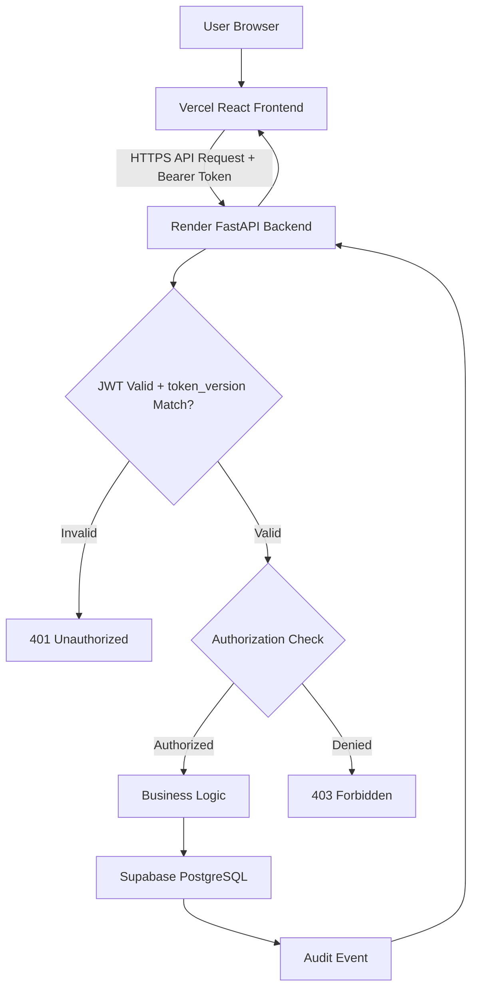
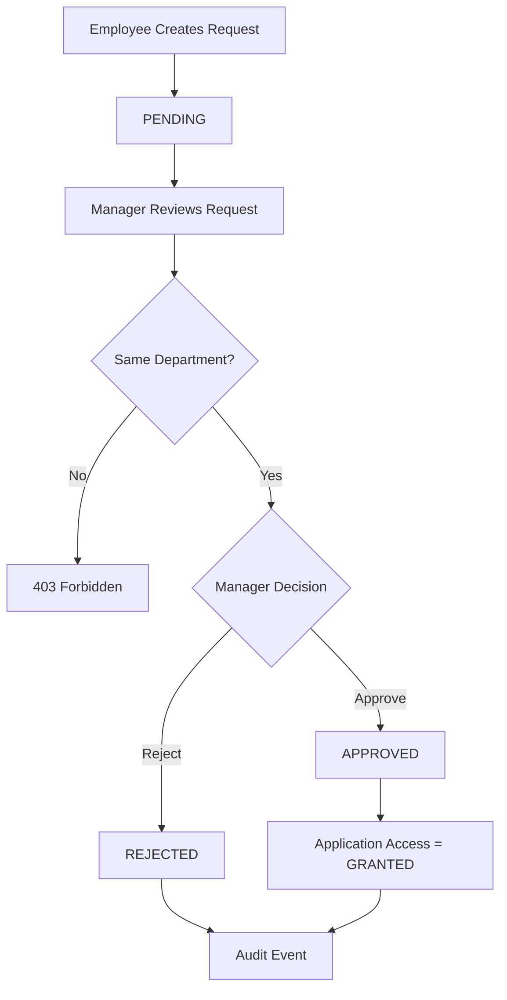
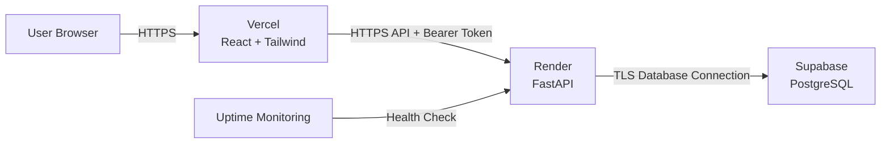

# System Architecture Document

## Project: Access Governance System (V1 — Semester Scope)

**Architecture Pattern:** Three-Tier Serverless/PaaS Architecture
**Deployment Model:** Zero-Cost MVP
**Frontend:** Vercel
**Backend:** Render
**Database:** Supabase PostgreSQL

**Scope note:** This document reflects the trimmed V1 scope defined in `PREREQUISITES.md`. MFA, CSRF, and threat detection are deferred to V2 (Section 15). Session auth uses header-based JWT, not cookies — this removes CSRF exposure by design, not by adding a separate CSRF layer.

---

# 1. Architecture Overview

```text
┌──────────────────────────────────────────┐
│              Presentation Layer           │
│       React + Tailwind on Vercel          │
└────────────────────┬─────────────────────┘
                      │ HTTPS
                      ▼
┌──────────────────────────────────────────┐
│              Application Layer            │
│        Python + FastAPI on Render         │
│                                            │
│ Authentication • RBAC • Access Governance │
│ Audit Logging                             │
└────────────────────┬─────────────────────┘
                      │ TLS
                      ▼
┌──────────────────────────────────────────┐
│                Data Layer                 │
│          Supabase PostgreSQL              │
│                                            │
│ Users • Roles • Resources • Requests      │
│ Access State • Audit Logs                 │
└──────────────────────────────────────────┘
```

The Python backend is the sole authority for authentication, authorization, RBAC enforcement, access governance workflows, and audit logging.

The frontend is an untrusted client and is not a security boundary.

---

# 2. System Components

## 2.1 Frontend

**Technology:** React + Tailwind
**Platform:** Vercel

Responsibilities:
* Display authentication screens
* Display role-specific dashboards
* Submit access requests
* Display request status and resource access
* Attach the JWT to the `Authorization` header on API requests
* Present authorization errors returned by the backend

The frontend must not independently determine whether an operation is authorized.

## 2.2 Backend

**Technology:** Python + FastAPI
**Platform:** Render

Responsible for:
* Authentication (password verification, Argon2id hashing)
* JWT issuance and validation
* `token_version` check against the database on every protected request (see Section 6)
* RBAC enforcement
* Department isolation
* Access request workflow
* Resource access state
* Audit logging
* Trusted client-IP resolution
* Last-active-Admin protection

All security-sensitive decisions occur on the backend.

## 2.3 Database

**Technology:** PostgreSQL
**Platform:** Supabase

Stores: Users, Departments, Roles, Permissions, Resources, Access Requests, User Resource Access, Audit Logs.

Database constraints, transactions, and **table-level permission grants** provide an additional integrity layer for security-sensitive operations (see Section 13 for audit log enforcement specifically).

---

# 3. High-Level Request Flow



---

# 4. Authentication Architecture

```text
User
 ↓
Email + Password
 ↓
FastAPI Backend
 ↓
Argon2id Password Verification
 ↓
Valid → Issue JWT (Authorization: Bearer)
Invalid → 401 Unauthorized
```

There is no MFA step in V1. This is a deliberate scope decision — see Section 15.

The backend issues the JWT only after password verification succeeds. There is no session cookie.

---

# 5. Password Security

Passwords are never stored in plaintext. The backend uses **Argon2id** for hashing and verification. Password processing occurs exclusively on the backend; the frontend never receives password hashes.

---

# 6. Session & Token Architecture

**V1 uses a stateless JWT delivered via the `Authorization: Bearer <token>` header — not a cookie.**

Rationale: Vercel (frontend) and Render (backend) are different origins. Cross-origin cookies (`SameSite=None`) are unreliable across browsers (notably Safari) and require CSRF protection to be safe. Header-based tokens sidestep both problems: there is no ambient credential for a browser to auto-attach, so CSRF does not apply to this design.

**Token storage on the frontend:**
* Default: store the JWT in memory (React state). A page refresh requires re-login. This is the accepted default for V1.
* If `localStorage` is used instead for convenience, this is a deviation and must be documented in `SECURITY.md` as an accepted XSS-related risk — not left implicit.

**Revocation — `token_version`:**
* Each user has a `token_version` integer column.
* The JWT payload embeds the `token_version` value at issue time.
* **On every protected request, the backend fetches the user's current `token_version` from the database and compares it to the value in the JWT.** A mismatch results in `401 Unauthorized`, even if the JWT signature and expiry are otherwise valid.
* `token_version` is incremented on role change, deactivation, or a forced logout.
* This means revocation costs one DB lookup per request — it is **not** free, stateless validation. This is a deliberate, minimal trade-off for V1 instead of building a full server-side session store. It must not be described as instantaneous or cost-free revocation elsewhere in the docs.

The signing secret (`JWT_SECRET`) is supplied through deployment environment configuration and is never committed to source control.

---

# 7. Authorization Architecture

```text
Authenticated User
        ↓
      Role
        ↓
   Permission
        ↓
Department Scope
        ↓
Requested Resource / Action
        ↓
Allow or Deny
```

The backend evaluates authorization on every protected operation. A frontend permission check may improve UX but cannot replace backend authorization.

---

# 8. RBAC Architecture

Three roles: `ADMIN`, `MANAGER`, `EMPLOYEE`.

* **Admin** — global application access.
* **Manager** — department-scoped access.
* **Employee** — self-service access (own requests/resources only).

Permissions are associated with roles through a `role_permissions` relationship, separating role definitions from individual permissions.

---

# 9. Department Isolation

Enforced through `users.department_id`. For a Manager accessing department-scoped data:

```text
manager.department_id == target_user.department_id
```

must be true, or the backend returns `403 Forbidden`. The frontend is never relied upon to enforce this.

---

# 10. Access Governance Architecture

```text
REQUEST → PENDING → APPROVED / REJECTED → GRANTED → REVOKED
```

Request workflow state and current access state are stored separately:

* **Request state** — `access_requests.status`: `PENDING`, `APPROVED`, `REJECTED`
* **Access state** — `user_resource_access.state`: `GRANTED`, `REVOKED`

An approved request creates or updates application-level access only. V1 does not provision access to any real external system (VPN, CRM, etc.).

---

# 11. Access Approval Flow



The approval operation runs inside a database transaction so that request status, access state, and the audit event remain consistent even if a step fails.

---

# 12. Audit Logging Architecture

Security-relevant actions generate audit events, e.g.:

```text
LOGIN_SUCCESS
LOGIN_FAILURE
ACCESS_REQUEST_CREATED
ACCESS_REQUEST_APPROVED
ACCESS_REQUEST_REJECTED
ACCESS_GRANTED
ACCESS_REVOKED
USER_CREATED
USER_UPDATED
USER_DEACTIVATED
ROLE_CHANGED
```

Audit records contain, where applicable: `Timestamp, Actor User ID, Target User ID, Department Context, Resource ID, Action, Status, Client IP, Metadata`.

**Append-only is enforced at two levels, not just documented:**
1. **API level:** no endpoint exposes UPDATE or DELETE for audit records.
2. **Database level:** the application's DB role has only `INSERT` and `SELECT` grants on the audit log table — no `UPDATE`/`DELETE` grants. This is the actual enforcement mechanism. The API-level restriction alone is not sufficient, since a future endpoint added carelessly, or direct DB access, could otherwise bypass it.

Table-level grant configuration must be reflected in `DATABASE_SCHEMA.md`.

---

# 13. Client IP Architecture

The application runs behind Vercel/Render infrastructure and trusted proxies, so forwarded headers must be handled carefully. The backend uses `X-Forwarded-For` only when the deployment's trusted-proxy configuration explicitly permits it, and never trusts an arbitrary client-supplied header directly. The resolved client IP is stored as PostgreSQL `INET` where available.

---

# 14. CORS Architecture

The backend allows requests only from an explicitly configured frontend origin (`CORS_ALLOWED_ORIGIN`). Unrestricted `*` CORS is not used. Since V1 uses header-based auth (no cookies), `credentials: include` / cookie-based CORS handling is not required — this is another simplification that follows directly from the header-token decision in Section 6.

---

# 15. Deferred to V2 (Explicitly Out of Scope for V1)

Removed from V1 architecture on purpose, per `PREREQUISITES.md` Section 8:

* MFA / TOTP / recovery codes
* CSRF protection (not applicable — no cookie-based session in V1)
* Brute-force detection / rolling-window rate limiting
* Out-of-hours activity flagging
* Threat/security alert dashboard
* SSO / external identity providers
* External application provisioning (VPN/CRM/ERP)

These are not architectural gaps — they are intentional exclusions to keep the semester scope achievable. List them as "future work" in the final report.

---

# 16. Database Connectivity

The FastAPI backend communicates with Supabase PostgreSQL over an encrypted (TLS) connection. Credentials are stored via `DATABASE_URL` in deployment secrets. The frontend never connects directly to the database — all operations pass through the backend API.

---

# 17. Secrets and Environment Configuration

Required configuration:

```text
DATABASE_URL
JWT_SECRET
CORS_ALLOWED_ORIGIN
```

`.env.example` may be committed; the real `.env` must be excluded via `.gitignore` and never contain production secrets in source control.

---

# 18. Last Active Admin Protection

The system must always retain at least one active Admin. The backend protects against deleting, deactivating, demoting, or role-removing the final active Admin.

A simple preflight count is insufficient under concurrency. The operation must use a transaction-safe mechanism that locks/rechecks the relevant Admin state before committing the change, so two concurrent requests cannot both pass a stale check and jointly remove the last Admin.

---

# 19. Transaction-Sensitive Operations

**Access Approval:**
```text
Validate request → Validate Manager authorization → Update request →
Grant application access → Create audit event → Commit
```

**Access Revocation:**
```text
Validate authorization → Revoke access → Create audit event → Commit
```

**Last Admin Protection:**
```text
Transaction → Lock/recheck Admin state → Verify another active Admin remains →
Perform requested change → Commit
```

---

# 20. Monitoring Architecture

Optional post-deployment uptime monitoring (e.g. UptimeRobot) may check `GET /health`. This detects basic availability only and does not replace authentication, authorization, or audit logging. Free-tier cold starts (Render) and inactivity pausing (Supabase) are accepted MVP constraints, not defects.

---

# 21. Deployment Architecture



---

# 22. Security Boundaries

**Boundary 1: Browser → Backend**
HTTPS, Authentication (JWT + `token_version` check), CORS, server-side authorization.

**Boundary 2: Backend → Database**
TLS, backend-only credentials, database constraints and table-level grants, transactions.

**Boundary 3: Role → Resource**
RBAC, permission checks, department isolation, resource-level access state.

---

# 23. V1 Architectural Constraints

Intentionally accepted for this scope:
* Free-tier service limits, possible cold starts
* No MFA, no CSRF layer, no threat detection (Section 15)
* No dedicated SIEM, no real-time DB subscriptions
* No automatic IP blocking
* No external identity provider or external application provisioning

These are scope decisions, not oversights.

---

# 24. Architecture Principles

1. Backend is the sole security authority.
2. Frontend is an untrusted client.
3. Header-based JWT replaces cookie sessions for this deployment topology — this is a deliberate architectural choice, not a simplification of security.
4. `token_version` revocation requires a DB check per request; it is documented as such, not described as free.
5. Least privilege enforced through RBAC and department scope.
6. Security-sensitive actions are auditable, and audit immutability is enforced at the database grant level, not only in the API.
7. Access requests and current access state are separate concepts.
8. Security-critical operations use transaction-safe controls.
9. Secrets are never committed to source control.
10. Deferred features (Section 15) are explicit scope decisions and must not be silently reintroduced during implementation.

---

# 25. Architecture Summary

```text
                    USER
                     │
                     ▼
          ┌─────────────────────┐
          │ Vercel Frontend      │
          │ React + Tailwind     │
          └──────────┬──────────┘
                      │ HTTPS + Bearer Token
                      ▼
          ┌─────────────────────┐
          │ Render Backend       │
          │ Python + FastAPI     │
          │                      │
          │ Authentication       │
          │ RBAC                 │
          │ Department Scope     │
          │ Access Governance    │
          │ Audit Logging        │
          └──────────┬──────────┘
                      │ TLS
                      ▼
          ┌─────────────────────┐
          │ Supabase PostgreSQL  │
          │                      │
          │ Users                │
          │ Roles                │
          │ Permissions          │
          │ Resources            │
          │ Access Requests      │
          │ Access State         │
          │ Audit Logs           │
          └─────────────────────┘
```

This architecture provides the foundation for implementing the Access Governance System (V1) within the finalized, zero-cost, semester-project scope.