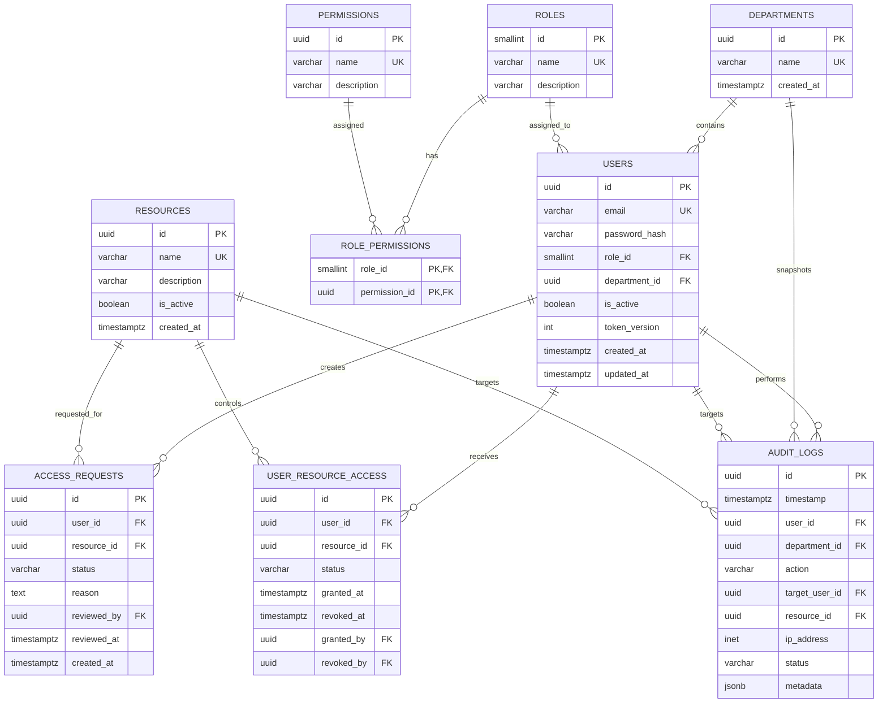

# Database Schema Document

**Project:** Access Governance System (V1 — Semester Scope)
**Database Engine:** PostgreSQL (via Supabase)

**Scope note:** This document reflects the trimmed V1 scope defined in `PREREQUISITES.md` and `ARCHITECTURE.md`. MFA tables and threat-detection support (brute-force/out-of-hours) are removed from V1 — see Section 17 (Deferred to V2). Two additions are made relative to the original draft: a `token_version` column on `users` for JWT revocation, and explicit database-level permission grants on `audit_logs` to enforce append-only at the DB layer, not just the API layer.

---

# 1. Purpose

This document defines the database architecture for the Access Governance System (V1).

The database supports:

* User and department management
* Role-Based Access Control (RBAC)
* Permission mapping
* Resource management
* Access request governance
* Application-level resource access state
* JWT session revocation (`token_version`)
* Audit logging
* Department-scoped authorization
* Historical audit context

The design uses a normalized relational structure and keeps the **access request lifecycle** separate from the **actual resource access state**.

---

# 2. Database Design Principles

1. **Relational integrity** — foreign keys maintain relationships between entities.
2. **Normalization** — core entities are separated to reduce duplication and update anomalies.
3. **Least privilege** — RBAC data supports controlled access based on role and scope; DB-level grants restrict what the application's own DB role can do (see Section 13.3).
4. **Separation of concerns** — request workflow and actual access state are stored separately.
5. **Auditability** — security-sensitive actions are recorded in `audit_logs`.
6. **Historical preservation** — access and audit history is not unnecessarily deleted.
7. **UTC timestamps** — all timestamp fields use `TIMESTAMPTZ`.
8. **Secure credential storage** — passwords are stored only as Argon2id hashes.

---

# 3. Entity Relationship Diagram



---

# 4. Lookup Tables

## 4.1 `roles`

| Column        | Type         | Constraints      | Description                    |
| ------------- | ------------ | ---------------- | ------------------------------ |
| `id`          | SMALLINT     | PRIMARY KEY      | Static role identifier         |
| `name`        | VARCHAR(50)  | UNIQUE, NOT NULL | `Admin`, `Manager`, `Employee` |
| `description` | VARCHAR(255) | NULL             | Role description               |

Recommended logical role IDs (application-defined constants, seeded consistently):

```text
1 = Admin
2 = Manager
3 = Employee
```

---

## 4.2 `permissions`

| Column        | Type         | Constraints      | Description             |
| ------------- | ------------ | ---------------- | ------------------------ |
| `id`          | UUID         | PRIMARY KEY      | Permission identifier    |
| `name`        | VARCHAR(100) | UNIQUE, NOT NULL | Permission name          |
| `description` | VARCHAR(255) | NULL             | Permission description   |

Examples:

```text
users.read
users.manage
departments.read
departments.manage
roles.read
roles.manage
resources.read
resources.manage
access_requests.create
access_requests.read_own
access_requests.read_department
access_requests.approve
access_requests.reject
access.read_own
access.read_department
access.grant
access.revoke
audit_logs.read
```

---

## 4.3 `departments`

| Column       | Type         | Constraints                              | Description            |
| ------------ | ------------ | ---------------------------------------- | ----------------------- |
| `id`         | UUID         | PRIMARY KEY, DEFAULT `gen_random_uuid()` | Department identifier   |
| `name`       | VARCHAR(100) | UNIQUE, NOT NULL                         | Department name         |
| `created_at` | TIMESTAMPTZ  | NOT NULL, DEFAULT `NOW()`                | Creation timestamp      |

Examples: `IT`, `HR`, `Finance`, `Sales`, `Operations`.

---

# 5. RBAC Mapping

## 5.1 `role_permissions`

| Column          | Type     | Constraints                         | Description |
| --------------- | -------- | ------------------------------------ | ----------- |
| `role_id`       | SMALLINT | PRIMARY KEY, FK → `roles(id)`        | Role        |
| `permission_id` | UUID     | PRIMARY KEY, FK → `permissions(id)`  | Permission  |

Primary key: `(role_id, permission_id)` — prevents duplicate assignment.

Foreign keys use `ON DELETE CASCADE`, since the mapping has no independent meaning without its role or permission.

---

# 6. Core User Table

## 6.1 `users`

| Column          | Type         | Constraints                              | Description             |
| --------------- | ------------ | ----------------------------------------- | ------------------------ |
| `id`            | UUID         | PRIMARY KEY, DEFAULT `gen_random_uuid()`  | User identifier          |
| `email`         | VARCHAR(255) | UNIQUE, NOT NULL                          | Login email              |
| `password_hash` | VARCHAR(255) | NOT NULL                                  | Argon2id password hash   |
| `role_id`       | SMALLINT     | NOT NULL, FK → `roles(id)`                | Assigned role            |
| `department_id` | UUID         | NULL, FK → `departments(id)`              | User's department        |
| `is_active`     | BOOLEAN      | NOT NULL, DEFAULT `TRUE`                  | Account status            |
| `token_version` | INTEGER      | NOT NULL, DEFAULT `0`                     | JWT revocation counter    |
| `created_at`    | TIMESTAMPTZ  | NOT NULL, DEFAULT `NOW()`                 | Creation timestamp        |
| `updated_at`    | TIMESTAMPTZ  | NOT NULL, DEFAULT `NOW()`                 | Last update timestamp     |

### `token_version` — JWT Revocation

Per `ARCHITECTURE.md` Section 6: every issued JWT embeds the user's `token_version` at issue time. On every protected request, the backend re-fetches the current `token_version` from this table and compares it to the JWT's embedded value. A mismatch → `401 Unauthorized`, regardless of signature/expiry validity.

`token_version` is incremented when:
* The user's role changes
* The user is deactivated
* An Admin forces a logout

This is a DB read on every authenticated request — a deliberate trade-off for V1 instead of a full server-side session store. It must not be described elsewhere as free/instant revocation.

### Department Rule

`department_id` is nullable because a global Admin may not belong to a specific department.

```text
Admin    → department_id may be NULL
Manager  → department_id should be assigned
Employee → department_id should be assigned
```

The backend enforces this role-specific requirement; it is not a DB-level CHECK constraint in V1.

---

# 7. Resources

## 7.1 `resources`

| Column        | Type         | Constraints                              | Description             |
| ------------- | ------------ | ----------------------------------------- | ------------------------ |
| `id`          | UUID         | PRIMARY KEY, DEFAULT `gen_random_uuid()`  | Resource identifier      |
| `name`        | VARCHAR(100) | UNIQUE, NOT NULL                          | Resource name            |
| `description` | TEXT         | NULL                                       | Resource description     |
| `is_active`   | BOOLEAN      | NOT NULL, DEFAULT `TRUE`                  | Resource availability     |
| `created_at`  | TIMESTAMPTZ  | NOT NULL, DEFAULT `NOW()`                 | Creation timestamp        |

Examples: `VPN`, `CRM`, `ERP`, `Internal Portal`, `File Server`. V1 does not provision access to external systems — a resource here is an application-level governed record only.

---

# 8. Access Governance

## 8.1 `access_requests`

| Column        | Type        | Constraints                              | Description                        |
| ------------- | ----------- | ------------------------------------------ | ------------------------------------ |
| `id`          | UUID        | PRIMARY KEY, DEFAULT `gen_random_uuid()`   | Request identifier                  |
| `user_id`     | UUID        | NOT NULL, FK → `users(id)`                 | Requester                            |
| `resource_id` | UUID        | NOT NULL, FK → `resources(id)`             | Requested resource                   |
| `status`      | VARCHAR(20) | NOT NULL                                    | `PENDING`, `APPROVED`, `REJECTED`   |
| `reason`      | TEXT        | NULL                                        | Request justification                |
| `reviewed_by` | UUID        | NULL, FK → `users(id)`                     | Admin/Manager reviewer               |
| `reviewed_at` | TIMESTAMPTZ | NULL                                        | Review timestamp                     |
| `created_at`  | TIMESTAMPTZ | NOT NULL, DEFAULT `NOW()`                  | Request creation time                |

This table must **not** contain `GRANTED`/`REVOKED` — those states belong to `user_resource_access`.

---

# 9. Approval and Access-State Transition

Request lifecycle and access lifecycle are separate.

**Request lifecycle:**
```text
PENDING → (Reject) → REJECTED
PENDING → (Approve) → APPROVED
```

**Access lifecycle:**
```text
GRANTED → (Revoke) → REVOKED
```

## 9.1 Approval Transaction

When an authorized Admin or Manager approves a pending request, the backend performs, as one transaction:

```text
1. Lock the access request row.
2. Verify status = PENDING.
3. Verify reviewer authorization and department scope.
4. Verify the resource is active.
5. Change request status: PENDING → APPROVED.
6. Create or update user_resource_access.
7. Set access status: GRANTED.
8. Set granted_at = NOW().
9. Record the approval/access action in audit_logs.
10. Commit.
```

If any step fails, the transaction rolls back — this prevents an `APPROVED` request with no corresponding access record.

## 9.2 Rejection Transaction

```text
PENDING → REJECTED
```

The backend sets `reviewed_by`, `reviewed_at`, and records the rejection in `audit_logs`. No `GRANTED` access record is created.

---

# 10. Actual Resource Access

## 10.1 `user_resource_access`

| Column        | Type        | Constraints                              | Description               |
| ------------- | ----------- | ------------------------------------------ | --------------------------- |
| `id`          | UUID        | PRIMARY KEY, DEFAULT `gen_random_uuid()`   | Access record identifier    |
| `user_id`     | UUID        | NOT NULL, FK → `users(id)`                 | Target user                  |
| `resource_id` | UUID        | NOT NULL, FK → `resources(id)`             | Target resource               |
| `status`      | VARCHAR(20) | NOT NULL                                    | `GRANTED`, `REVOKED`         |
| `granted_at`  | TIMESTAMPTZ | NULL                                        | Grant timestamp               |
| `revoked_at`  | TIMESTAMPTZ | NULL                                        | Revocation timestamp          |
| `granted_by`  | UUID        | NULL, FK → `users(id)`                     | User who granted access       |
| `revoked_by`  | UUID        | NULL, FK → `users(id)`                     | User who revoked access       |

## 10.2 Grant Transition

```text
status = GRANTED
granted_at = NOW()
granted_by = authenticated reviewer
revoked_at = NULL
revoked_by = NULL
```

## 10.3 Revoke Transition

```text
status = REVOKED
revoked_at = NOW()
revoked_by = authenticated reviewer
```

Historical records are not deleted simply to remove current access.

---

# 11. Access-State Uniqueness

## 11.1 One Pending Request

```sql
CREATE UNIQUE INDEX idx_unique_pending_request
ON access_requests (user_id, resource_id)
WHERE status = 'PENDING';
```

Historical `APPROVED`/`REJECTED` requests for the same pair remain allowed.

## 11.2 One Active Grant

```sql
CREATE UNIQUE INDEX idx_unique_active_grant
ON user_resource_access (user_id, resource_id)
WHERE status = 'GRANTED';
```

Historical `REVOKED` records remain possible.

---

# 12. Audit Logging

## 12.1 `audit_logs`

| Column           | Type         | Constraints                              | Description                        |
| ---------------- | ------------ | ------------------------------------------ | ------------------------------------ |
| `id`             | UUID         | PRIMARY KEY, DEFAULT `gen_random_uuid()`   | Log identifier                        |
| `timestamp`      | TIMESTAMPTZ  | NOT NULL, DEFAULT `NOW()`                  | Event timestamp                       |
| `user_id`        | UUID         | NULL, FK → `users(id)`                     | Actor                                  |
| `department_id`  | UUID         | NULL, FK → `departments(id)`               | Department snapshot                    |
| `action`         | VARCHAR(100) | NOT NULL                                    | Action performed                        |
| `target_user_id` | UUID         | NULL, FK → `users(id)`                     | Target user                            |
| `resource_id`    | UUID         | NULL, FK → `resources(id)`                 | Target resource                        |
| `ip_address`     | INET         | NOT NULL                                    | Client IP                              |
| `status`         | VARCHAR(50)  | NOT NULL                                    | `SUCCESS`, `FAILURE`                  |
| `metadata`       | JSONB        | NULL                                        | Additional structured event data       |

Example logged actions (V1 scope): `LOGIN_SUCCESS`, `LOGIN_FAILURE`, `ACCESS_REQUEST_CREATED`, `ACCESS_REQUEST_APPROVED`, `ACCESS_REQUEST_REJECTED`, `ACCESS_GRANTED`, `ACCESS_REVOKED`, `USER_CREATED`, `USER_UPDATED`, `USER_DEACTIVATED`, `ROLE_CHANGED`.

`status = WARNING` is removed from V1 since it was only used for out-of-hours flagging, which is deferred (Section 17).

## 12.2 Historical Department Context

`audit_logs.department_id` is a snapshot of the actor's department at event time — it does not update if the user later moves departments. This preserves accurate historical context for privileged actions.

## 12.3 Audit Append-Only Policy — Enforced at Two Levels

This is not a documentation-only rule; it is enforced structurally:

**API level:** No endpoint in the application exposes UPDATE or DELETE for `audit_logs` rows. Only `INSERT` (via logging) and `SELECT` (via read/reporting endpoints) are implemented.

**Database level (the actual enforcement mechanism):** The application's database role must be granted only `INSERT` and `SELECT` on `audit_logs` — no `UPDATE`, no `DELETE`. Example:

```sql
REVOKE UPDATE, DELETE ON audit_logs FROM app_role;
GRANT INSERT, SELECT ON audit_logs TO app_role;
```

This ensures that even if a future endpoint were added carelessly, or the database were accessed directly through the application's credentials, audit rows still cannot be altered or removed. This does not make the table cryptographically tamper-proof (e.g. it does not defend against a superuser/DBA-level compromise) — it only guarantees the application itself cannot modify history. That distinction should be stated as-is in `SECURITY.md`, not overstated as full immutability.

---

# 13. Foreign Key Delete Behavior

Deletion behavior must preserve security history.

* **`users → audit_logs`**: `ON DELETE SET NULL` — preserves audit events if the actor account is removed.
* **`users → access_requests`**: prefer `ON DELETE RESTRICT`, or soft-delete users via `is_active = FALSE` instead of hard delete.
* **`users → user_resource_access`**: prefer preserving access history over physical deletion.
* **`role_permissions`**: `ON DELETE CASCADE` for the mapping rows.
* **`audit_logs → departments`**: `ON DELETE SET NULL` — prevents historical audit records from being deleted when a department is removed.

Exact FK policies must be implemented consistently in the migration scripts.

---

# 14. Performance Indexes

## Users

```sql
CREATE INDEX idx_users_department ON users (department_id);
CREATE INDEX idx_users_role ON users (role_id);
```

The unique constraint on `email` already indexes email lookup.

## Access Requests

```sql
CREATE INDEX idx_access_requests_user ON access_requests (user_id);
CREATE INDEX idx_access_requests_resource ON access_requests (resource_id);
CREATE INDEX idx_access_requests_status ON access_requests (status);
CREATE INDEX idx_access_requests_created_at ON access_requests (created_at DESC);
```

## User Resource Access

```sql
CREATE INDEX idx_user_resource_access_user ON user_resource_access (user_id);
CREATE INDEX idx_user_resource_access_resource ON user_resource_access (resource_id);
CREATE INDEX idx_user_resource_access_status ON user_resource_access (status);
```

## Audit Logs

```sql
CREATE INDEX idx_audit_timestamp ON audit_logs (timestamp DESC);
CREATE INDEX idx_audit_user ON audit_logs (user_id);
CREATE INDEX idx_audit_target_user ON audit_logs (target_user_id);
CREATE INDEX idx_audit_action ON audit_logs (action);
CREATE INDEX idx_audit_ip ON audit_logs (ip_address);
```

---

# 15. Security-Related Database Rules

## 15.1 Passwords

The database never stores plaintext passwords — only Argon2id hashes.

## 15.2 IP Address

`ip_address` uses PostgreSQL `INET`. The backend determines the real client IP using trusted proxy configuration and does not blindly trust an arbitrary client-supplied `X-Forwarded-For` header.

## 15.3 `token_version` Access

`token_version` should not be exposed through normal API responses beyond what's needed for the client to know it's been logged out — it is an internal revocation counter, not user-facing data.

---

# 16. Transaction Boundaries

* **Access Approval:** request status update + access grant + audit log, as one transaction (Section 9.1).
* **Access Revocation:** access state update + audit log, as one transaction.
* **Last Active Admin Protection:** operations that could remove the final active Admin must use an atomic, lock-and-recheck transaction (see `ARCHITECTURE.md` Section 18) — a simple preflight count is not sufficient under concurrency.
* **`token_version` increment:** role change / deactivation / forced logout and the corresponding audit log entry should be written in the same transaction, so a role change can't be recorded as audited without the revocation actually taking effect.

---

# 17. Deferred to V2 (Removed From V1 Schema)

The following tables/support are intentionally **not** in the V1 schema, consistent with `PREREQUISITES.md` Section 8 and `ARCHITECTURE.md` Section 15:

* `mfa_settings`, `mfa_recovery_codes` — no MFA in V1
* Brute-force detection query support (rolling 5-minute failed-login window analysis)
* Out-of-hours login flagging (`status = WARNING` on `audit_logs`)
* External SSO / Google / Microsoft auth tables
* External VPN/CRM/ERP provisioning tables
* ML-based anomaly detection support

These are explicit scope exclusions, not gaps to "remember to add." List them as future work in the final report if referenced.

---

# 18. Timestamp Standard

All timestamps use `TIMESTAMPTZ`, stored in UTC: `created_at`, `updated_at`, `reviewed_at`, `granted_at`, `revoked_at`, `timestamp`. The frontend may convert to local time for display.

---

# 19. UUID Strategy

UUIDs (`gen_random_uuid()`) are used for: Users, Departments, Permissions, Resources, Access Requests, Resource Access records, Audit Logs. `Roles` use `SMALLINT` since the V1 role set is small and fixed.

---

# 20. Final Data Model

```text
departments
     │
     └── users ── roles ── role_permissions ── permissions
          │
          ├── access_requests ── resources
          │
          ├── user_resource_access ── resources
          │
          └── audit_logs
```

Critical separation:

```text
access_requests        →  PENDING / APPROVED / REJECTED   (the governance decision)
user_resource_access    →  GRANTED / REVOKED                (the resulting access state)
```

Revocation changes the actual access state without deleting historical information.

---

# 21. Final Database Rules (Locked for V1)

1. PostgreSQL via Supabase is the database engine.
2. Users belong to a role.
3. Admins may have `department_id = NULL`.
4. Managers and Employees are department-scoped.
5. Roles and permissions are separated through `role_permissions`.
6. Access requests and actual resource access use separate tables.
7. `access_requests.status` allows only `PENDING`, `APPROVED`, `REJECTED`.
8. `user_resource_access.status` allows only `GRANTED`, `REVOKED`.
9. Approval and access grant are handled atomically in one transaction.
10. Rejection does not create granted access.
11. Revocation does not delete historical access records.
12. Only one pending request per user/resource is allowed.
13. Only one active grant per user/resource is allowed.
14. Passwords use Argon2id hashes.
15. `users.token_version` exists and is checked on every authenticated request for JWT revocation.
16. Audit logs are append-only, enforced both at the API level (no update/delete endpoints) and the database level (`app_role` has no UPDATE/DELETE grant on `audit_logs`).
17. Audit logs preserve historical department context.
18. All timestamps use UTC `TIMESTAMPTZ`.
19. Privileged state changes must be audited.
20. Last active Admin protection must be transaction-safe.
21. Department isolation is enforced by the backend, not by frontend filtering.
22. V1 does not perform external application provisioning.
23. MFA tables and threat-detection query support are excluded from V1 (Section 17).

This schema is the authoritative database model for the **Access Governance System (V1)**.